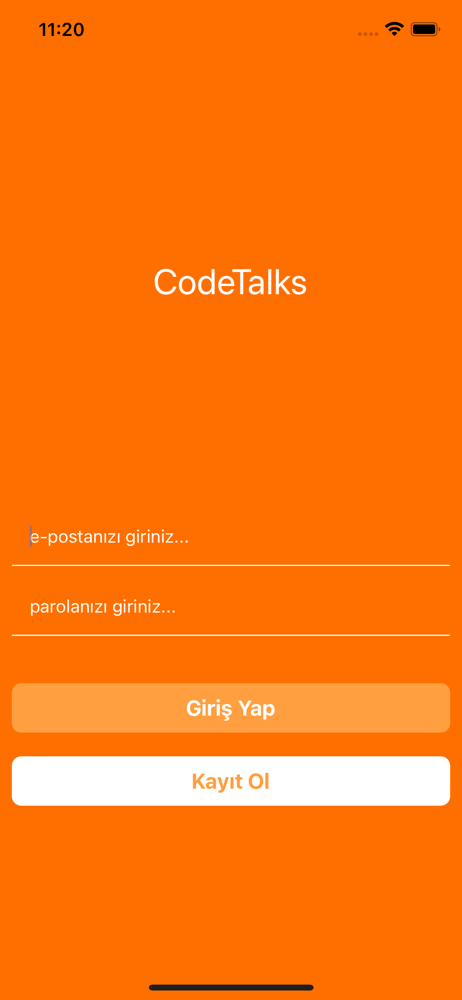
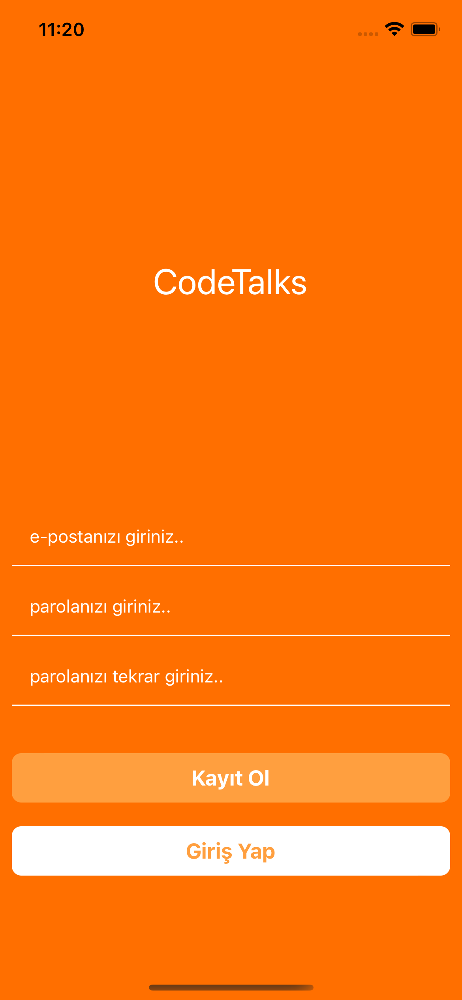
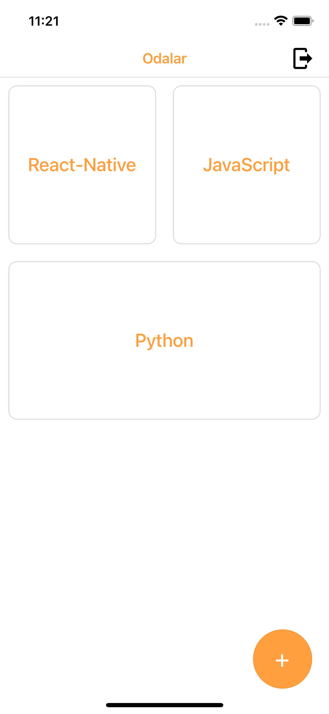
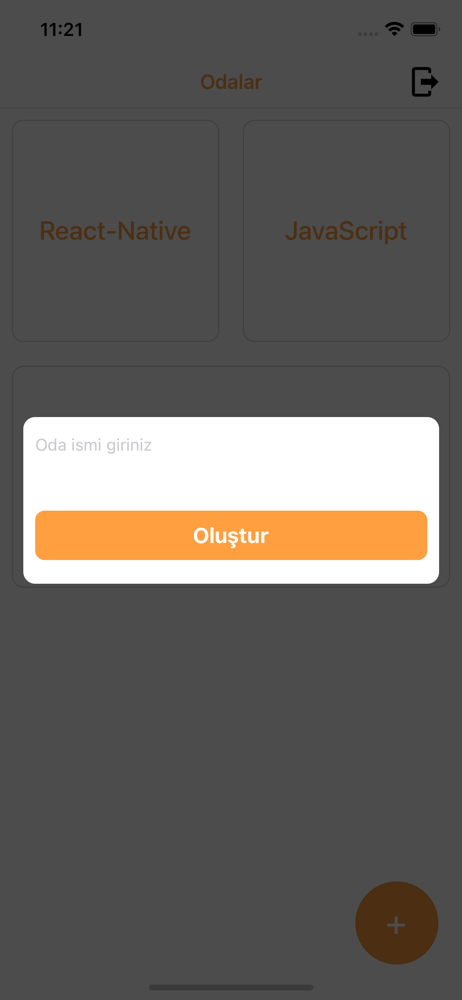
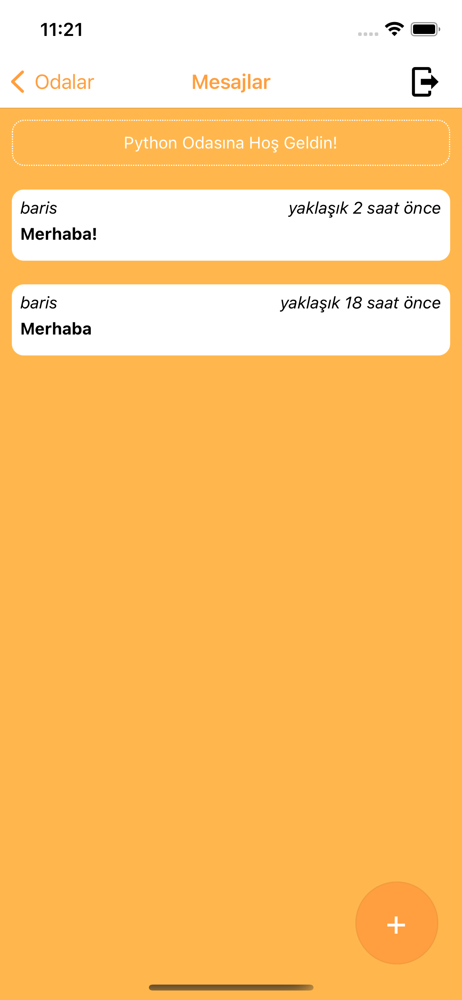
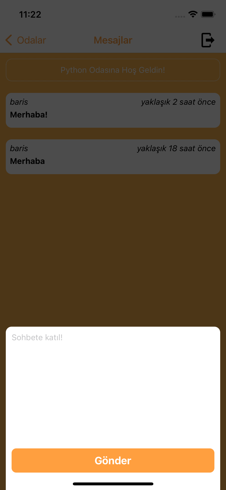

# codetalks

codetalks app for React-Native course on [Patika](https://app.patika.dev)

you can create an account and send it to people who don't care!

# Here images of Application

     

# Tools & Resources

- [React Navigation](https://reactnavigation.org/)
- [babel-plugin-module-resolver](https://github.com/tleunen/babel-plugin-module-resolver)
- [React Native Firebase](https://rnfirebase.io/)
- [Firebase](https://firebase.google.com/)
- [react-native-flash-message](https://github.com/lucasferreira/react-native-flash-message)
- [react-native-modal](https://github.com/react-native-modal/react-native-modal)
- [Formik](https://github.com/jaredpalmer/formik)
- [react-native-vector-icons](https://github.com/oblador/react-native-vector-icons)
- [date-fns](https://date-fns.org/)

# Setup

- Install [React Native](https://reactnative.dev/docs/getting-started)
- Run on your terminal 'git clone https://github.com/bariskndmr/codetalksdeneme'
- Run in root directory with terminal 'npm install'
- Run 'npx react-natice run-ios/run-android' when 'npm install' finished
